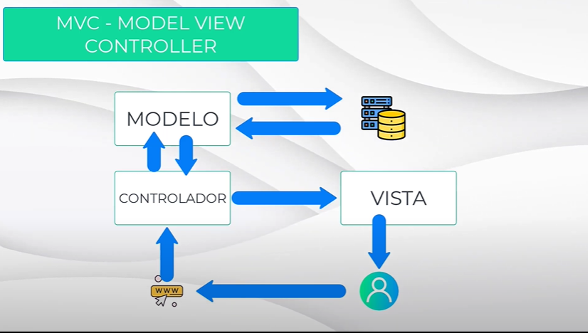

# Teoría Django

## ¿Qué es Django?

Es un framework escrito en python. Un framework es un marco de trabajo que nos dará un conjunto de herramientas, librerias, estructuras, que facilitan todo el proceso de trabajo.
Esto hace que el desarrollo sea más ágil, reutilizable y que esté bien estructurado.

## Patrón de arquitectura MTV (model template view - modelo plantilla vista)

Es una variante de MVC (model view controller - modelo vista controlador).

MVC  -> 